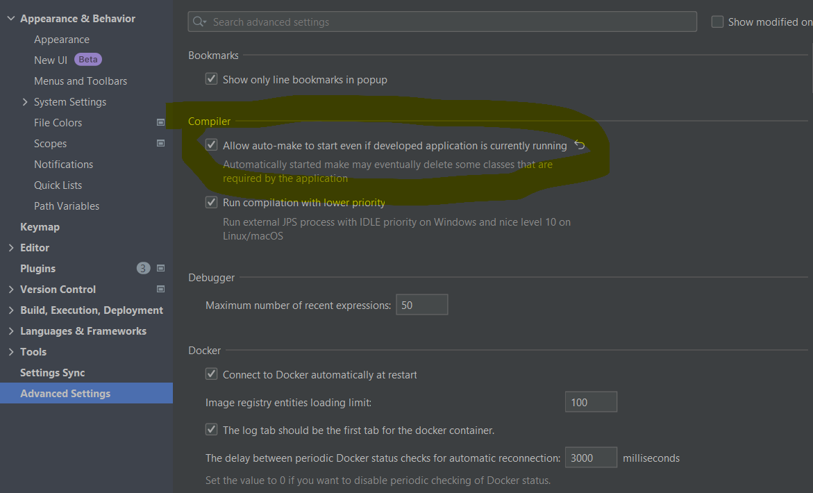
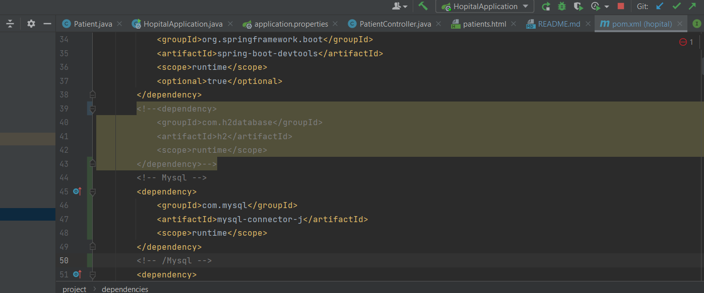

<h1>Spring MVC</h1>
<h2>Configution de devTools</h2>
1- Ouvrir fichier

2- Cliquer sur paramètre avancé

3- Cocher allow auto-make to start

4- Dérouler sur build, Execute, deploy  
5- Cliquer sur compiler

5- Cocher build project automatically

<h2>Installation de bootstrap</h2>
1- Recherche de la dépendance et aller sur le site

2- Sélectionner la dernière version 

3- Copier la dépendance

4- Ajouter dans le pom.xml

5- Utiliser dans la page html

<h2>Utilisation de MySQL</h2>
1- Installation de la dépendance

2- Configuration de mysql

<h2>Controller patient</h2>
<b>1- Création du controller patient</b>

Le controller patient permet de récupérer la liste des patients à partir du repository et la transmet à la page html via l'objet Model de springframework.ui?
grace à l'annotation model.addAttribut 

<b>2- Mise en place de la page HTML</b>

Utilisation des données transmises à la page html depuis le controller via l'attribut "patientList" qui est utilisé pour afficher les donner en faisant une boucle.

<b>3- Affichage de la page</b>

Puisque le port 8084 a été précisé dans le fichier application.properties alors pour voir la page il faut aller sur cet url : http://localhost:8084/index

<b>4- Mise en place de la pagination</b>  
<b>4.1- Modification de patientContoller</b>

Ici il est demandé à spring d'afficher la première page mais il faut qu'il affiche les 4 premières données de la base de données

<b>4.2- Affichage de la page avec la pagination</b>

<i>Pourtant nous avons 12 lignes dans la base de données</i>

<b>5- Affichage de la page en utilisant des paramètres</b>  
<b>5.1- Modification du controller</b>

Ici le controller est modifié de tel sorte à permettre à l'utilisateur, via le navigateur de décider le nombre de ligne et la page a afficher

<b>5.2- Demonstration</b>
<i>Affichage de la page 0 avec 5 données</i>

<i>Affichage de la page 2 avec 5 données</i>

5.3- Initialisation de valeurs de page et size

Grace à @RequestParam nous allons demander a spring d'aller chercher le paramètre page et size dans l'url si on ne trouve rien alors,
nous allons transmettre les valeurs par défaut 0 et 5

6. Pagination  
6.1- Html

6.2- Controller

7. Recherche

8. Suppression 

9. Rendu

<h2>Mise en place d'une page template avec thymeleaf</h2>
1- Recherche de la dépendance thymelead layout dialect maven (11)
2- Choix de la dernière version
3- Ajout dans le fichier POM.xml
4- Création de la page template HTML  
5- Ajout des dialect thymeleaf et layout
6- Ajout de la section ou afficher les autres pages dans le template
7- Utilisation du template dans une autre page
<i>Il faut noter que dans layout:decorate="template1", <b>template1</b> fait référence au nom de la page template </i>
8- Determination du contenu à insérer dans la section content1 du template1
<h2>Validation</h2>
1. Installer spring boot validation maven  
