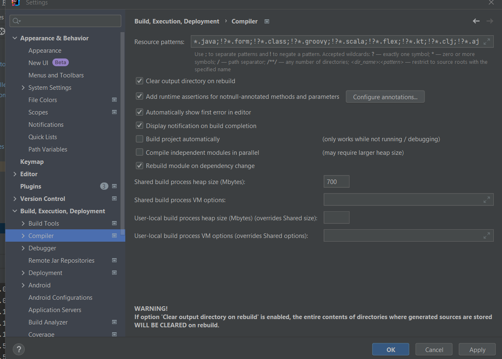

<h1>Spring MVC</h1>
<h2>Configution de devTools</h2>
1- Ouvrir fichier

2- Cliquer sur paramètre avancé

3- Cocher allow auto-*make to start

4- Dérouler sur build, Execute, deploy
5- Cliquer sur compiler

5- Cocher build project automatically

<h2>Installation de bootstrap</h2>
1- Recherche de la dépendance et aller sur le site

2- Sélectionner la dernière version 

3- Copier la dépendance

4- Ajouter dans le pom.xml

5- Utiliser dans la page html

